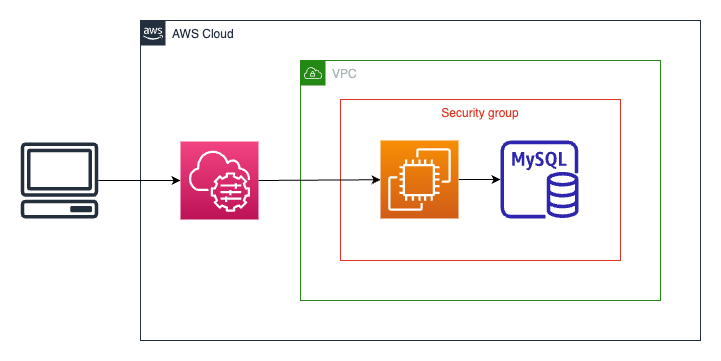
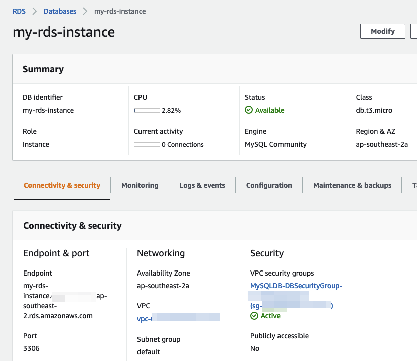
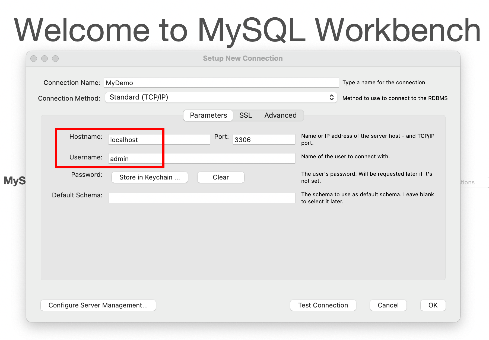
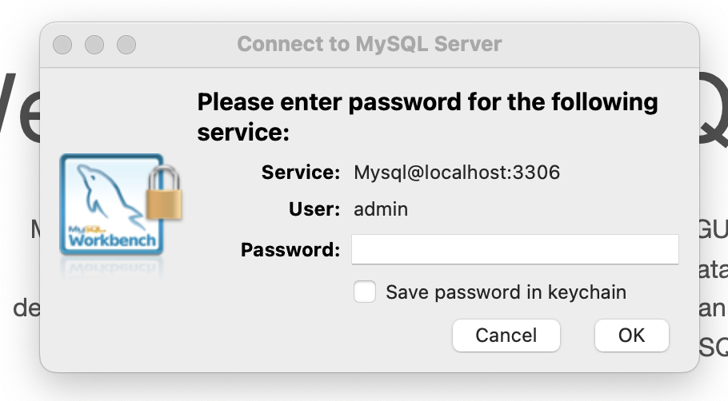
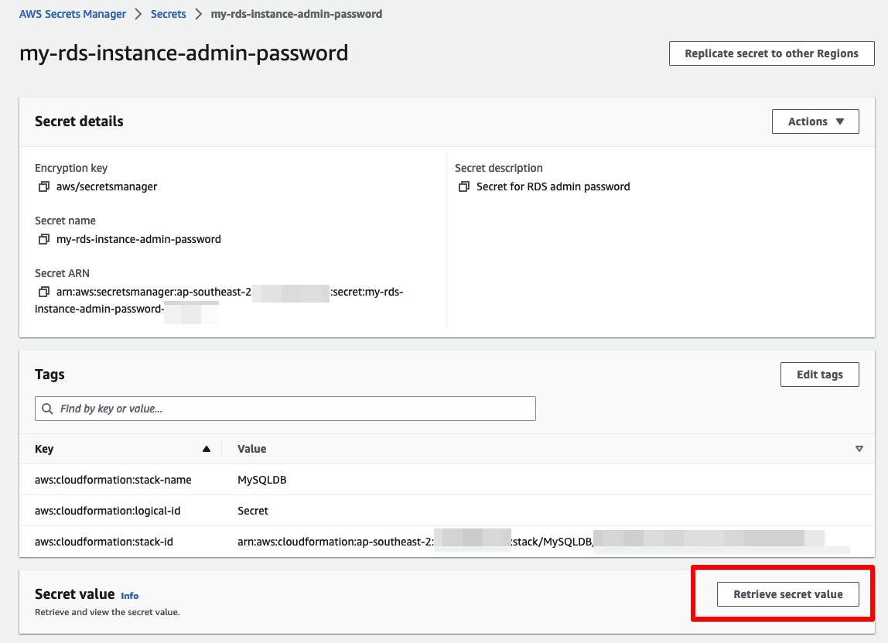
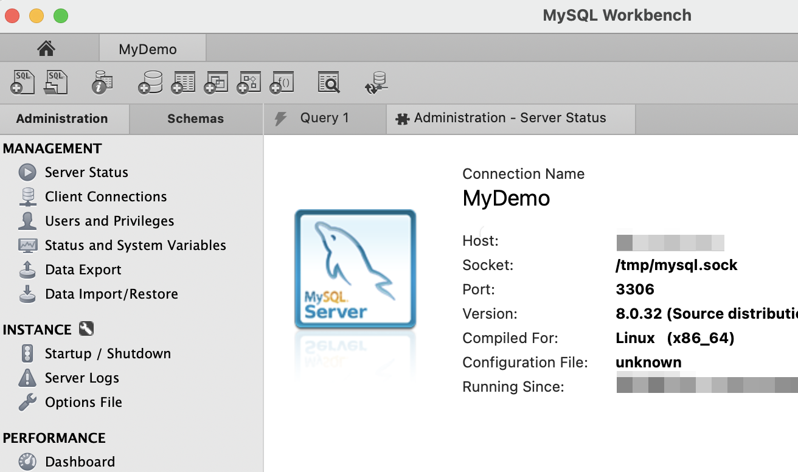

# Advanced Configurations

Some of the advanced options within **Fleet Manager** require an encrypted connection to SSM. I have included a new **01-VPCEndpoint.yaml** file that creates an endpoint for KMS [Note: I've often forgotten this step and wondered why I my KMS wasn't working]. The other file **02-KMS-SSM-key.yaml** creates the KMS CMK with appropriate permissions to allow SSM access.

The KMS access is configured within **Session Manager** Preferences.


Select Edit, check the **Enable KMS** option, then select the key **alias/SSMKey**.


Finally, remember to **Save**


After this, your shell sessions will now be encrypted.
```
% 
% aws ssm start-session \
    --target $INSTANCE \
    --region ap-southeast-2

Starting session with SessionId: <user>-01bc24f3b95e34a7e
This session is encrypted using AWS KMS.
sh-4.2$ 
sh-4.2$ whoami
ssm-user
sh-4.2$ 
sh-4.2$ exit
exit


Exiting session with sessionId: <user>-01bc24f3b95e34a7e.

jasonwood@Faramir .aws %
```

Now is also an excellent time to look at **Fleet Manager** and see what you can do with KMS disabled. The base functionality will still work, but some connection items require KMS. The KMS requirement is more prevalent with Windows tools.

## Connecting via EC2
In the intermediate section, we looked at how to connect to RDP via the CLI. There is another SSM document that allows Port Forwarding to a Remote Host. This lets us do cool tricks like connecting to private RDS instances.



The command for this is ...
```
aws ssm start-session \
    --target $INSTANCE \
    --region ap-southeast-2 \
    --document-name AWS-StartPortForwardingSessionToRemoteHost \
    --parameters '{"host":["my-rds-instance.<unique code>.ap-southeast-2.rds.amazonaws.com"],"portNumber":["3306"], "localPortNumber":["3306"]}'
```
For an RDS instance, the **host** parameter is the **Endpoint**. 



Similar to RDS connections, when running this document, a connection is created and sits active.

```
% aws ssm start-session \
    --target $INSTANCE \
    --region ap-southeast-2 \
    --document-name AWS-StartPortForwardingSessionToRemoteHost \
    --parameters '{"host":["my-rds-instance.<unique id>.ap-southeast-2.rds.amazonaws.com"],"portNumber":["3306"], "localPortNumber":["3306"]}'

Starting session with SessionId: <user>-050c52e59ec5bc34f
Port 3306 opened for sessionId <user>-050c52e59ec5bc34f.
Waiting for connections...
```
I'm using MySQL Workbench for my connection to the RDS instance. When configuring the connection, choose **localhost** for the hostname (127.0.0.1 also works) and **admin** as the user.



The login window then asks for a password.



You can find the password in **Secrets Manager**.



Finally, you get connected ...




