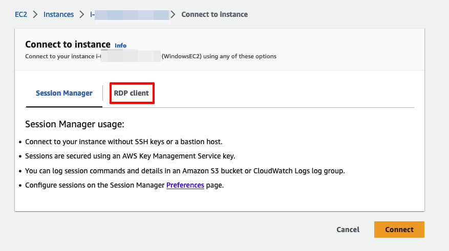

# What is SSM
Simple Systems Manager or Systems Manager or SSM is a suite of tools to allow management of EC2 instances. This demo will focus on the core component of secure server access. And you don't even need inbound or outbound internet access!

## Cost
This demo simulates a secure environment where there is no direct outbound access. To connect to AWS services, VPC Endpoints are used. We also spin up 2 x T3.Micro servers and use a KMS key. 

| Description   | Hourly Cost | Monthly Cost |
|---------------|-------------|--------------|
| EC2 Linux     | $0.0132     | $9.636       |
| EC2 Windows   | $0.0224     | $16.352      |
| VPC Endpoints | $0.052      | $37.97       |
| KMS Key       | N/A         | $1.03        |

# SSM Connectivity Requirements
SSM has several requirements before it will connect. Firstly, the EC2 instances need to have a role with permissions to connect to the SSM service. Secondly, the EC2 instances need to have the SSM agent installed. This comes default with several AMIs, including Windows and Amazon Linux 2. Finally, the instances need to talk to the SSM service. This can be done either via outbound internet \(Internet Gateway or NAT Gateway\) or using VPC Endpoints. 

## Instance Profile/Role
This one is fairly easy thanks to an AWS managed policy, AmazonSSMManagedInstanceCore. Either create an Instance Profile or a Role and attach that to your EC. 

## Endpoints - Demo starts here!
There are three endpoints needed for full SSM access: SSM, SSMMessages, and EC2Messages. In this example, I am using a single AZ for all endpoints, along with a single Security Group. We don't need any HA for this demo.

**NOTE: Some aspects don't work as well in Melb right now (March 2023). While you can do most things, you may want to run this demo from Syd.**

Deploy Endpoints from the VPCEndpoint.yaml.

 

## EC2 Instances
There is no specific requirement for EC2 instances other than having an agent installed. The agent is installed by default on most Windows, Amazon Linux, Amazon Linux 2, SUSE, Ubuntu, macOS, & EKS-Optimized Amazon Linux AMIs.

The included EC2-Instances.yaml creates:
- A Security Group with no inbound access
- An instance profile and role for SSM access
- A basic Linux instance
- A basic Windows instance

## Console connectivity
Once all the above has been met and your servers are running, you can now use SSM to connect. You can even RDP to Windows servers.

To do so, either right click on the instance name and select Connect or hit the Connect button.

For Melbourne region:

For Sydney region:

The Windows server may take a little while longer for the SSM agent to be ready. If the "Connect" button is greyed out, give it a little longer.

For Melbourne region:

For Syudney region:

These can also be accessed from the **Systems Manager** console. **Session Manager** can be used, but we'll be checking out **Fleet Manager**.

## Fleet Manager
Fleet Manager gives a lot of tools to manage individual instances from a central console. You can play with the tools at your leisure, but for this demo we will focus on the Connect options.

**NOTE: Not all the tools are available in Melbourne at this time (March 2023)**

The initial **Fleet Manager** screen shows you the connected EC2 instances and their status. From here, you can select an instance and then connect. For Windows instances, there is also an option to RDP into the instance.

If you select the **Connect with Remote Desktop** option, you are given three choices to connect:
- User credentials
- Key Pair
- Single Sign-On

You are then given an RDP session in a small window. By clicking the icon in the top right, you can open to full screen.

