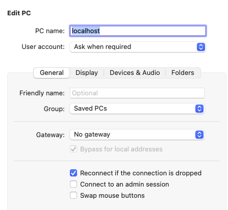
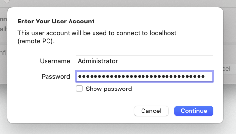
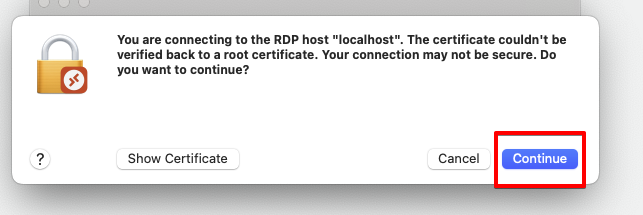
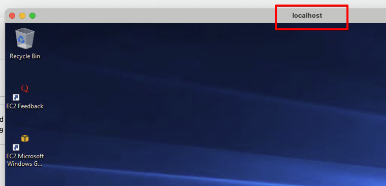

# The Next Steps

### NOTE
I will be assuming that you have configured CLI access. There are various methods to connect, depending on whether you have SSO or not, so I won't be providing examples of that. If you need any assistance, please ask.

The below examples use a Linux syntax. If you are using a Windows Command shell or PowerShell, please make the appropriate adjustments. This is mainly the continuation character ("\\" for Linux). If you're having issues, just put the whole command on one line.

## Install AWS CLI v2
To be able to access the instances, you need to have the AWS CLI v2 installed on your PC. Version 2 supports the SSM plugin, so make sure that's the version you have installed.

Install link: https://docs.aws.amazon.com/cli/latest/userguide/getting-started-install.html

There are packages for macOS, Windows, and Linux.

## Install SSM Plugin
Connectivity for Session Manager is not part of the default AWS CLI. To get that access, you need to install the SSM Plugin. Again, there are packages for macOS, Windows, and Linux.

Install link: https://docs.aws.amazon.com/systems-manager/latest/userguide/session-manager-working-with-install-plugin.html

## Get the Instance ID
All the SSM commands in this demo require the Instance ID for the EC2 you want to access. Assuming you have tagged your instance with a Name, the following CLI command can help:

```
aws ec2 describe-instances --output text --query 'Reservations[*].Instances[*].[[Tags[?Key==`Name`].Value] [0][0], InstanceId, State.Name ]' --region ap-southeast-2
```

The output will look something like this:
```
% aws ec2 describe-instances --output text --query 'Reservations[*].Instances[*].[[Tags[?Key==`Name`].Value] [0][0], InstanceId, State.Name ]' --region ap-southeast-2
WindowsEC2      i-012345678abcdefgh     running
LinuxEC2        i-abcdefgh012345678     running
%
```
You can then set the InstanceID as a variable. ```export INSTANCE=i-012345678abcdefgh```

Note: This is for ap-southeast-2. Update as appropriate.

## Starting a basic command session
Earlier we showed how to access your instances from the console. Now we will do so from the CLI of your PC.

### Shell connection
This first command gives you a shell connection to the EC2, either SSH for Linux or PowerShell for Windows:
```
aws ssm start-session \
    --target $INSTANCE \
    --region ap-southeast-2
```

### RDP connection
For Windows servers, you will likely want to connect via RDP. You can do that with the SSM Port Forwarding command:
```
aws ssm start-session \
    --document-name AWS-StartPortForwardingSession \
    --parameters '{"portNumber":["3389"], "localPortNumber":["3389"]}' \
    --target $INSTANCE \
    --region ap-southeast-2
```
When you run the above command it will connect and then keep your command window/terminal session open. 

```
Starting session with SessionId: <user>-01134611dd129ba8
Port 3389 opened for sessionId <user>-01134611dd129ba8.
Waiting for connections...
```

At that point:
- fire up your RDP client
- connect to - localhost
- log in with the Administrator user
- **Get the Administrator user from the console via the Key Pair**

The macOS config screen



Get the Windows Administrator password from the EC2 Connect screen

![alt text](../Images/Inter-02-RDP-Password.png "EC Instance Connect window with Windows password"Login with the Administrator user



If you get a certificate warning, just click **Continue**



RDP client window



Note: You can use Port Forwarding for anything with an open port. If you are running a web server, you can map 80 or 443 and connect to the website running on the server.